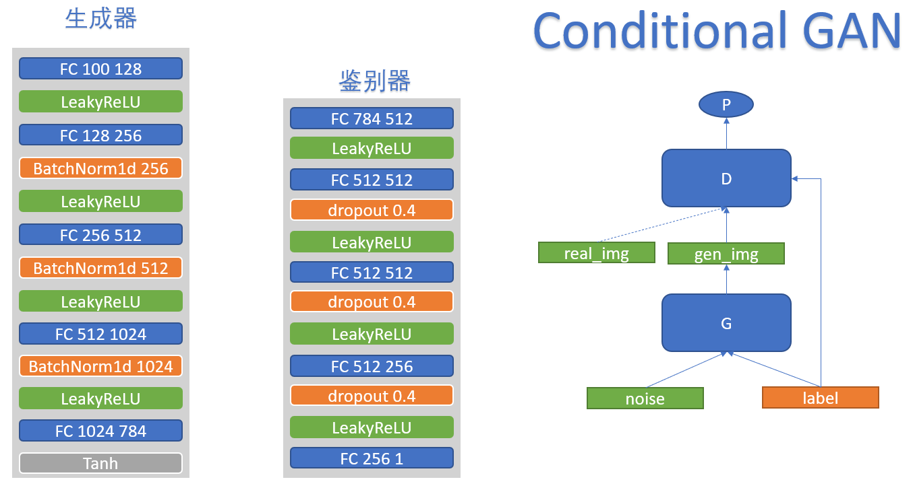
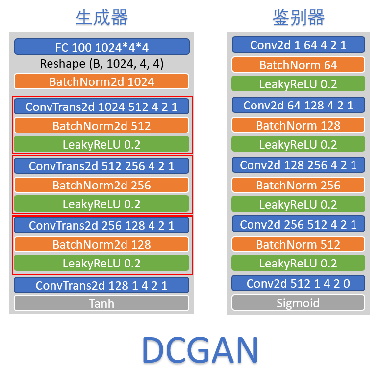

- [标准GAN架构](#标准gan架构)
- [条件GAN架构(CGAN)](#条件gan架构cgan)
- [深度卷积GAN架构(DCGAN)](#深度卷积gan架构dcgan)

# 标准GAN架构

# 条件GAN架构(CGAN)

# 深度卷积GAN架构(DCGAN)

在复现这个模型的时候, 原文中并没有对模型的架构做过多的解释, 所以在生成器部分如何从100维的噪声数据映射到1024维的隐空间这部分比较困惑. 参考了以下博客才得以理解. 使用一个线性层从 (64 * 100) 映射到 (64 * 1024 * 4 * 4) 的特征向量, 其中64为batch_size. 1024 * 4 * 4是因为原文的架构图中就是这样设置的.

https://blog.csdn.net/Solomon1558/article/details/52573596?spm=1001.2101.3001.6661.1&utm_medium=distribute.pc_relevant_t0.none-task-blog-2%7Edefault%7ECTRLIST%7ERate-1-52573596-blog-103371910.pc_relevant_recovery_v2&depth_1-utm_source=distribute.pc_relevant_t0.none-task-blog-2%7Edefault%7ECTRLIST%7ERate-1-52573596-blog-103371910.pc_relevant_recovery_v2&utm_relevant_index=1